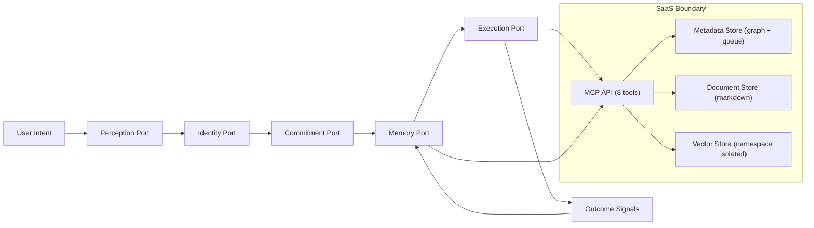

# Holistic Intent Computer Architecture (Scaffold)

## Why this exists

This scaffold translates three source clusters from `~/Mind` into code-first architecture contracts:

- `the intent computer` map: the system must compose perception, memory, commitment, identity, and execution as one loop.
- `arscontexta architecture`: behavioral-spec invariance, MCP interface boundary, and infrastructure-substitution migration path.
- `arscontexta SaaS strategy`: proposition-native memory moat, three-tier cloud substrate, activation/retention constraints.

This is not a full implementation. It is a stable interface spine for the next build phases.

## Architectural constraints captured

1. Five layers compose simultaneously, not sequentially.
2. The loop is explicit: `intent -> context -> action -> observation -> update`.
3. MCP server boundary is storage/retrieval only (no LLM inference in server path).
4. SaaS storage is split by access pattern:
- metadata/queue in relational storage
- markdown content in object storage
- vectors in namespace-isolated vector storage
5. Hybrid local/cloud runtime remains possible via adapter swaps, not skill rewrites.

## Code scaffold map

| File | Role |
|---|---|
| `src/architecture/domain.ts` | Canonical domain types for intents, propositions, gaps, commitments, execution, and pipeline lifecycle |
| `src/architecture/ports.ts` | Five-layer runtime ports plus lifecycle/pipeline extension ports |
| `src/architecture/intent-loop.ts` | Composed cycle orchestrator across the five layers |
| `src/architecture/holistic-runtime.ts` | Session lifecycle + intent loop + optional background pipeline runtime shell |
| `src/architecture/mcp-contracts.ts` | MCP tool boundary contracts (`vault_context`, `inbox_capture`, `thought_search`, etc.) |
| `src/architecture/saas-contracts.ts` | Auth/tenant plus three-tier storage interfaces for cloud adapters |
| `src/architecture/index.ts` | Barrel export for architecture module |

## Loop and boundary diagram

## Next implementation steps

1. Add local adapters implementing `PerceptionPort`, `MemoryPort`, and `ExecutionPort` against current vault files and hooks.
2. Add cloud adapters implementing `SaaSInfrastructurePorts` and map them into `IntentComputerMcpApi`.
3. Route `src/index.ts` hook flow through `HolisticIntentComputerRuntime` incrementally (start with session start/context + write path).
4. Add contract tests for the intent loop and MCP tool invariants.

